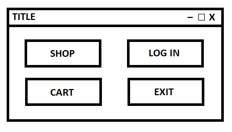
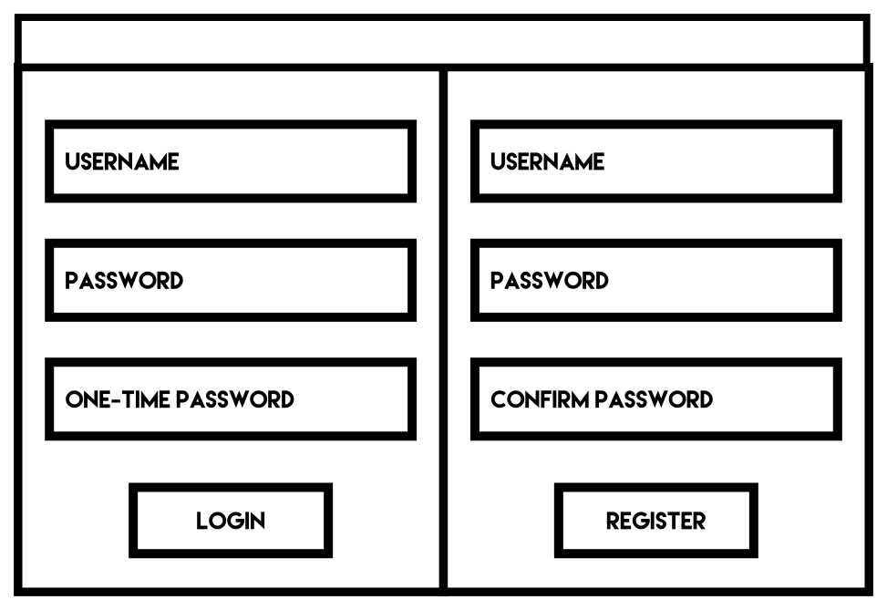
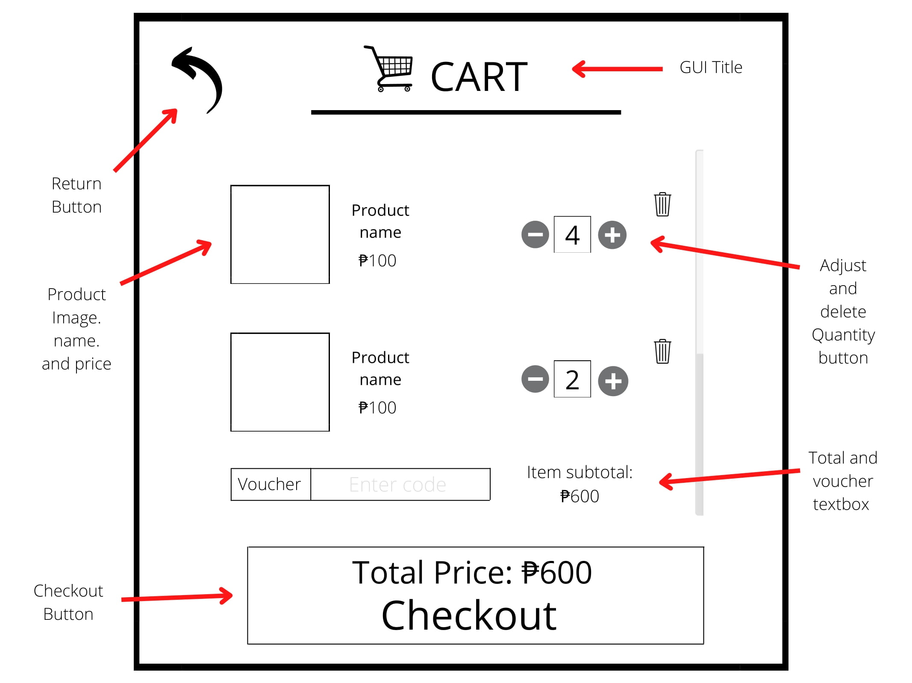
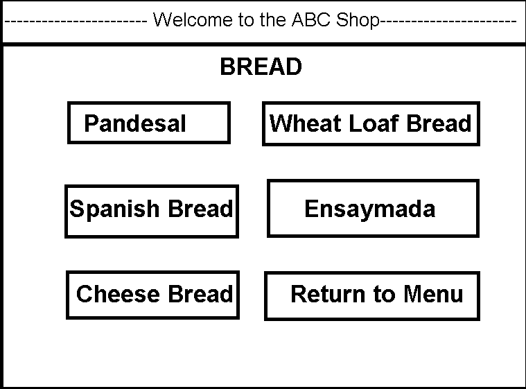

## Automated Bakery Cashier ##
__Description:__
A fully graphical application to automate customer-to-business transactions in the context of a bakery.

__Problems:__
1. Long customer queues especially at rush hours.
2. Miscommunication of orders.
3. Miscalculation of prices and change.
4. Manual tracking of product sales and available stocks.
5. The Staff in smaller bakeries usually handle both cashier and baker role.

__Objectives:__
The program aims to achieve the following objectives to help benefit bakeries:
1. Reduce the time spent in queue processing for the bakery especially at peak hours (Solves #1). 
2. Increase the efficiency of the bakery operations specifically at the Front of House which would:
    1. Increase overall satisfaction for the customers.
    2. Attract more customers.
    3. Decrease workload on staff (solves #5).
3. Decrease the labor cost for the bakery to maximize earnings.
4. Automate the selling of products (Solves #2 & #3).
5. Efficiently track product sales and stocks via an admin panel. (solves #4).

__Team Members:__
| # |   Role                                | Name                      |
|---|---------------------------------------|---------------------------|
|1. | Navigation (Main menu to other parts) |ABELARDO, ANTONIO GABRIEL  | 
|2. | Account system designer               |GARCIA, SONS JUSTIN        |
|3. | Inventory system designer (shop)      |MILANA, ASHLEIGH NELSON    |
|4. | Project Lead and admin system         |SAN JUAN, JEAN CARLO       |
|5. | Inventory system designer (user)      |TRINIDAD, LORENZO EARL     |

__Screen Designs:__
1. Main menu

2. Login screen

3. Cart and checkout

4. Product listing
